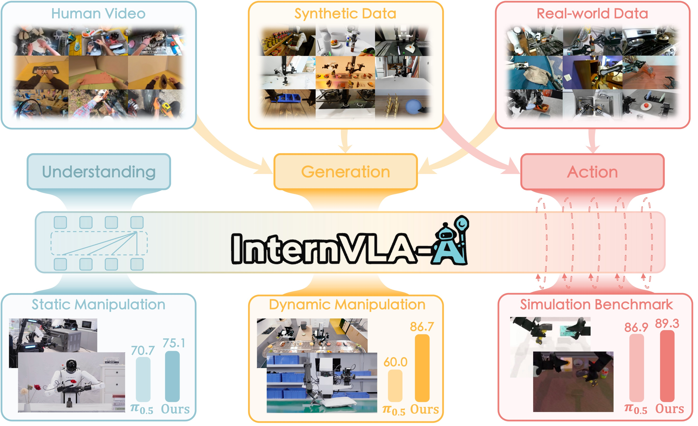
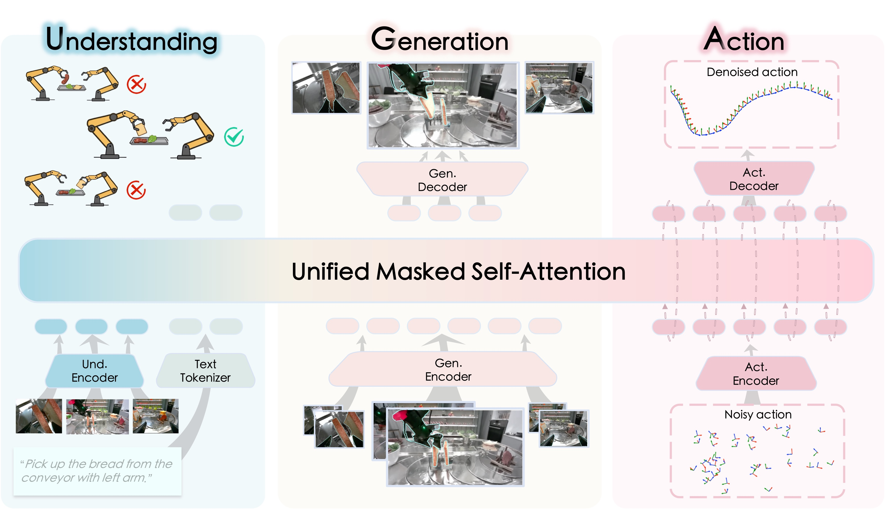

<div align="center">

# InternVLA-A1: Unifying Understanding, Generation, and Action for Robotic Manipulation​

</div>



[](https://internrobotics.github.io/internvla-a1.github.io/paper/InternVLA_A1.pdf)
[](https://huggingface.co/InternRobotics/InternVLA-A1-3B)
[](https://huggingface.co/datasets/InternRobotics/InternData-A1)
[](https://internrobotics.github.io/internvla-a1.github.io/)

## 🔥 Highlights
> **InternVLA-A1** unifies scene ***understanding***, visual foresight ***generation***, and ***action*** execution into a single framework.



- 🔮 *The Core: Synergizes MLLM's semantic understanding with world-model-style dynamic prediction, enabling it to "imagine" the future and guide adaptive actions.*
- 🚀 *The Fuel: Enables joint training on heterogeneous data sources over real-world robot data, synthetic simulation data, and egocentric human videos.*
- ⚡ *The Output: Tackles highly dynamic scenarios with effortless mastery.*

>  **InternVLA-A1** delivers superior performance across both real-world deployments and simulation benchmarks.
- **Real-World:** Robust execution across 12 diverse tasks, including dynamic scenarios such as conveyor belt sorting.

<table width="100%">
  <tr>
    <td width="33%" style="border:0; padding: 5px;">
      <video src="https://github.com/user-attachments/assets/f05f2ff7-b9eb-4072-ac9e-73766d0fe7c8" autoplay loop muted playsinline style="width: 100%;"></video>
    </td>
    <td width="33%" style="border:0; padding: 5px;">
      <video src="https://github.com/user-attachments/assets/f06c1cc8-1da0-4580-86e1-3eafab7b86d9" autoplay loop muted playsinline style="width: 100%;"></video>
    </td>
    <td width="33%" style="border:0; padding: 5px;">
      <video src="https://github.com/user-attachments/assets/4c4c17a3-cc3a-4ef2-9f6f-893d6cd895dd" autoplay loop muted playsinline style="width: 100%;"></video>
    </td>
  </tr>
  <tr>
    <td width="33%" style="border:0; padding: 5px;">
      <video src="https://github.com/user-attachments/assets/9930636b-a0c3-4c15-a72a-3cc203e331b7" autoplay loop muted playsinline style="width: 100%;"></video>
    </td>
    <td width="33%" style="border:0; padding: 5px;">
      <video src="https://github.com/user-attachments/assets/24c05142-7088-495b-9502-f03b211d71a4" autoplay loop muted playsinline style="width: 100%;"></video>
    </td>
    <td width="33%" style="border:0; padding: 5px;">
      <video src="https://github.com/user-attachments/assets/26503505-63cc-4e41-84f4-00bf419ce195" autoplay loop muted playsinline style="width: 100%;"></video>
    </td>
  </tr>
</table>

- **Simulation:** State-of-the-art results on RoboTwin 2.0 Benchmark (averaged over 50 tasks)

| Metric | $\pi_0$ | $\pi_{0.5}$ | **InternVLA-A1-3B** |
|--------|---------|-------------|---------------------|
| Avg. Success (Easy) | 79.98% | 86.76% | **89.40%**   |
| Avg. Success (Hard) | 79.50% | 86.96% | **89.64%**   |

## 📢 News

- **[2026/02/27]** Support weighting different datasets during training. 
- **[2026/01/23]** InternVLA-A1-3B achieves State-of-The-Art result on RoboTwin 2.0 benchmark! We have released the finetuned model **InternVLA-A1-3B-RoboTwin** on 🤗 [HuggingFace](https://huggingface.co/InternRobotics/InternVLA-A1-3B-RoboTwin).
- **[2026/01/14]** We release the Pre-training code and guidelines of InternVLA-A1-3B.
- **[2026/01/07]** We released our [paper](https://arxiv.org/pdf/2601.02456) on arXiv.
- **[2026/01/05]** We release the InternVLA-A1 codebase (for LeRobot V3.0 ecosystem).


## 📅 TODO List
- [x] Release InternVLA-A1-3B
- [x] Release fine-tuning code on downstream tasks
- [x] Release pretraining code on large-scale dataset
- [ ] Release InternVLA-A1-2B


## 📑 Table of Contents
- [Installation](#section-Installation)
- [Playground](#section-Playground)
- [Pre-training](#section-Pretraining)
- [Fine-tuning](#section-Finetuning)
  - [Finetuning on LeRobot V2.1 dataset](#subsection-Finetuning-on-LeRobotV21-dataset) 
  - [Finetuning on RoboTwin 2.0](#subsection-Finetuning-on-RoboTwin2_0) 
- [Evaluation & Inference](#section-Evaluation)

---
<span id="section-Installation"></span>
## 🛠️ Installation

This repository has been tested on **Python 3.10**, **CUDA 12.8** and **PyTorch 2.7.1**. We recommend using **conda** to create an isolated environment.

Please refer to [Installation Tutorial](tutorials/installation.md) to prepare your environment.

---

<span id="section-Playground"></span>
## 🕹️ Playground

### Quick start with `lerobot/pusht`

#### One-line command

```bash
bash launch/internvla_a1_3b_finetune.sh lerobot/pusht abs false
```

Here, **`abs`** indicates using **absolute actions**, and **`false`** means that the training
script will use the **statistics file (`stats.json`) provided by `lerobot/pusht` itself**.

---
<span id="section-Pretraining"></span>
## 🌐 Pre-Training
Please refer to the [Pre-training Tutorial](tutorials/pretrain_internvla_a1_with_interndata_a1.md) for instructions on pretraining InternVLA-A1-3B with the [**InternData-A1**](https://huggingface.co/datasets/InternRobotics/InternData-A1) dataset.

---
<span id="section-Finetuning"></span>
## 🎯 Fine-tuning

<span id="subsection-Finetuning-on-LeRobotV21-dataset"></span>
### Fine-tuning on LeRobot V2.1 dataset

Please refer to the [LeRobot V2.1 Fine-tuning Tutorial](tutorials/finetune_on_lerobot_v21_dataset.md) to finetune InternVLA-A1-3B with real-world datasets in the LeRobot V2.1 format. This guide walks you through the complete pipeline:
Download Dataset → Convert to v3.0 Format → Fine-tune on Pick-Pen Task

<span id="subsection-Finetuning-on-RoboTwin2_0"></span>
### Fine-tuning on RoboTwin 2.0 benchmark
Benchmark InternVLA-A1-3B: [RoboTwin 2.0 Finetune Tutorial](tutorials/finetune_internvla_a1_with_robotwin.md) | [RoboTwin 2.0  Eval Tutorial](evaluation/RoboTwin/README.md).

<span id="section-Evaluation"></span>
## 📊 Evaluation & Inference

Please refer to [Evaluation Guideline](https://github.com/InternRobotics/InternVLA-A1/blob/master/tests/policies/internvla_a1_3b/open_loop_genie1_real.ipynb) for the complete inference and evaluation workflow for InternVLA-A1-3B.

## License and Citation
All the code within this repo are under [CC BY-NC-SA 4.0](https://creativecommons.org/licenses/by-nc-sa/4.0/). Please consider citing our project if it helps your research.

```BibTeX
@article{internvla_a1,
  title={InternVLA-A1: Unifying Understanding, Generation and Action for Robotic Manipulation},
  author={Cai, Junhao and Cai, Zetao and Cao, Jiafei and Chen, Yilun and He, Zeyu and Jiang, Lei and Li, Hang and Li, Hengjie and Li, Yang and Liu, Yufei and others},
  journal={arXiv preprint arXiv:2601.02456},
  year={2026}
}
```

## Contact
If you have any questions, feel free to submit GitHub issues or email jiazeng.ai@gmail.com.

## Acknowledgments

- [Lerobot](https://github.com/huggingface/lerobot)
- [openpi](https://github.com/Physical-Intelligence/openpi)
- [InternVL](https://github.com/OpenGVLab/InternVL)
- [Qwen3-VL](https://github.com/QwenLM/Qwen3-VL)
- [COSMOS](https://github.com/nvidia-cosmos)

